# Dashboard Project Overview
This DevOps pipeline is orchestrated by Jenkins, utilizing Git repositories. It is designed to showcase skills in (CI/CD) (IAC) and high-availability, auto-scaling, pipeline integration and debug.

## Demo
[https://dashboard.ikocs.net](https://dashboard.ikocs.net)
Username: guest, Password: guest
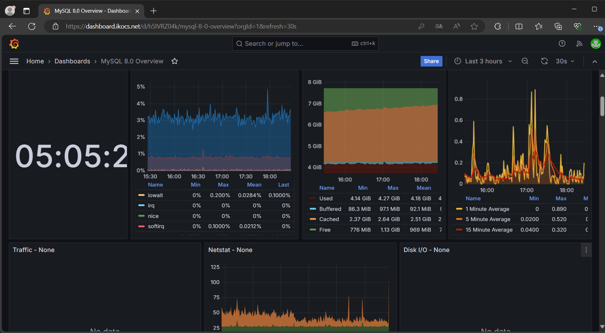

## Project Structure

The project is composed of three Git repositories:
1. **iac-dashboardbundle**
2. **cicd-dashboardbundle**
3. **dashboardbundle**

Each repository contains two main branches: `main` and `deploy`.
Where developing should be done in `main`, and `deploy` should only merge `main`.

## Project Workflow
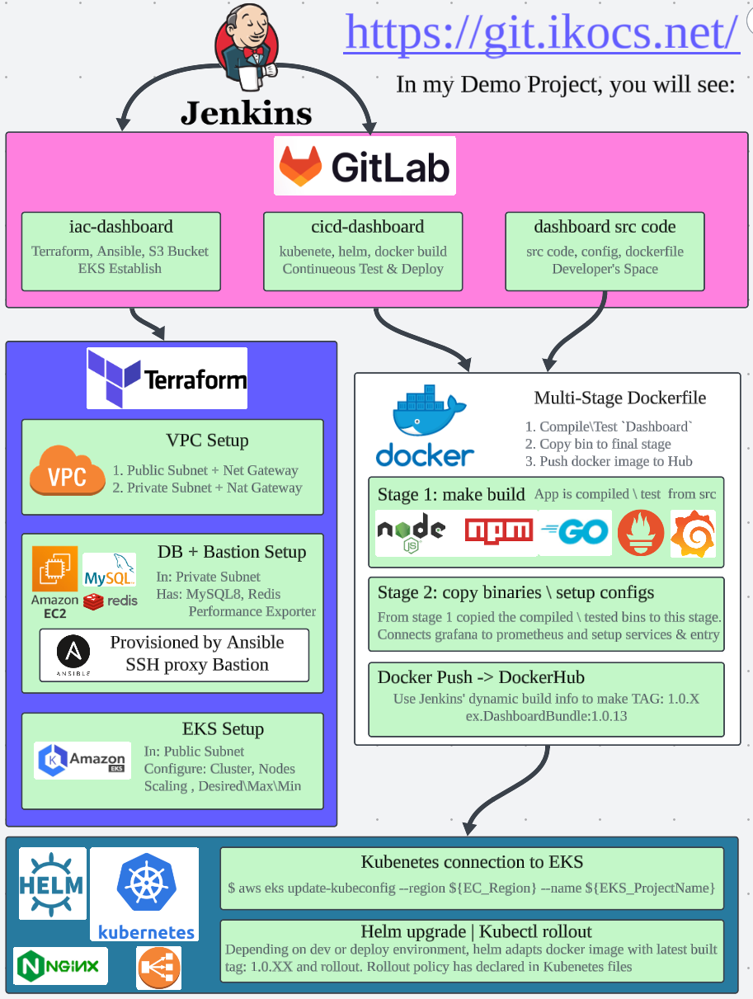

## Orchestration with Jenkins

Jenkins orchestrates the entire CI/CD process. It is configured to trigger specific actions based on GitLab webhook events, ensuring seamless automation from code push to deployment.

### Infrastructure as Code (IaC) with Terraform

When there is a push to the `deploy` branch of the `iac-dashboardbundle` repository, GitLab sends a webhook to Jenkins, triggering the Terraform deployment process. The key steps involved are:

1. **VPC and Subnet Creation**:
   - A VPC with two public subnets and one private subnet.
   - Internet Gateway and NAT Gateway setup for each subnet.

2. **Server Provisioning**:
   - Creation of a DB server in the private subnet.
   - Creation of a Bastion server in the public subnet.

3. **Provisioning with Ansible**:
   - Using Terraform's provisioner module, Ansible is called to configure the DB server.
   - Connection to the DB server is done through an SSH proxy via the Bastion server.
   - Installation and configuration of MySQL, Redis, MySQL-exporter, and Node-exporter.
   - S3 bucket connection for storage needs.

4. **Kubernetes Cluster Setup with EKS**:
   - Creation of a Kubernetes cluster and nodes in the public subnets.
   - Node scaling configuration, including default, maximum, and minimum node counts.

### CI/CD Pipeline for Dashboard Bundle

When there is a push to the `deploy` branch of the `cicd-dashboardbundle` repository, GitLab sends a webhook to Jenkins, triggering the Kubernetes deployment process. The key steps involved are:

1. **Git Pull and Docker Build**:
   - Pull the latest Prometheus source code from the `dashboardbundle` repository.
   - Use a multi-stage Dockerfile to build the Docker image:
     - **First Stage**: Download dependencies and compile Prometheus.
     - **Second Stage**: Copy the compiled binaries, configure the runtime environment, and set up Grafana.
   - Push the built image (versioned as `1.0.x` where `x` is the Jenkins pipeline execution number) to DockerHub.

2. **Kubernetes Deployment**:
   - Use the Helm chart from `cicd-dashboardbundle` to ensure proper Nginx and LoadBalancer configuration.
   - Deploy the necessary number of Pods within the Kubernetes cluster, with auto-scaling based on CPU usage.

## Jenkins Setup and Configuration

### How to Deploy Jenkins and Configure Project Connections

1. **Create an Ubuntu Instance**: Run the provisioning script located at `iac-dashboardbundle/JenkinsProvisioning.sh`. This script will install the following:
   - OpenJDK 17
   - Jenkins
   - Unzip
   - AWS CLI
   - Terraform
   - Ansible
   - kubectl
   - Helm
   - Docker CE

2. **Install Required Plugins**: Install the following Jenkins plugins:
   - Git
   - Pipeline
   - AWS Credentials

3. **Configure Jenkins Credentials**:
   - **AWS**: Connect to S3 Bucket and EKS.
   - **ikocs-california**: Configure the login PEM for each EC2 instance.
   - **DockerHub**: Upload the built Docker images.
   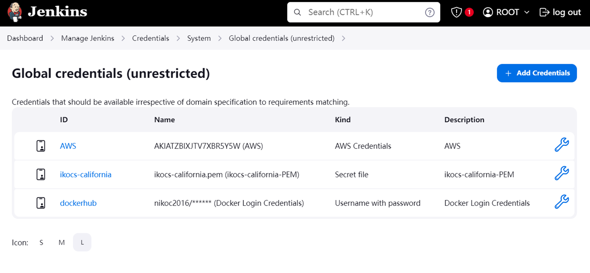

4. **Create Pipelines**: Create `iac_dashboard` and `cicd_dashboard` pipelines and set their triggers to `gitlab_push`.
   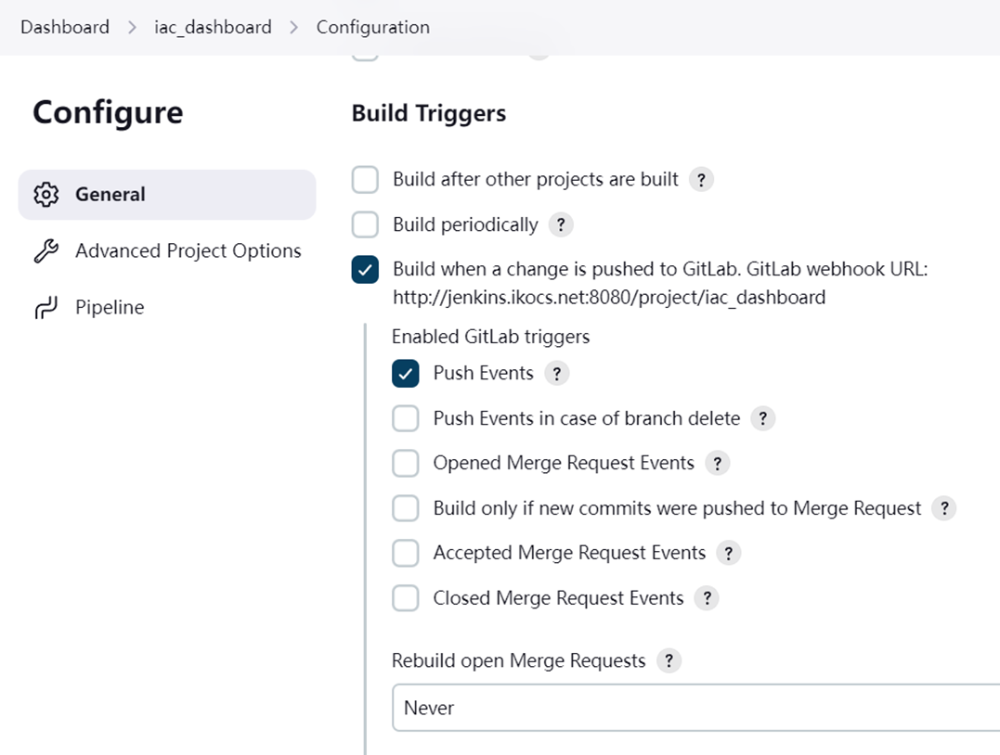
   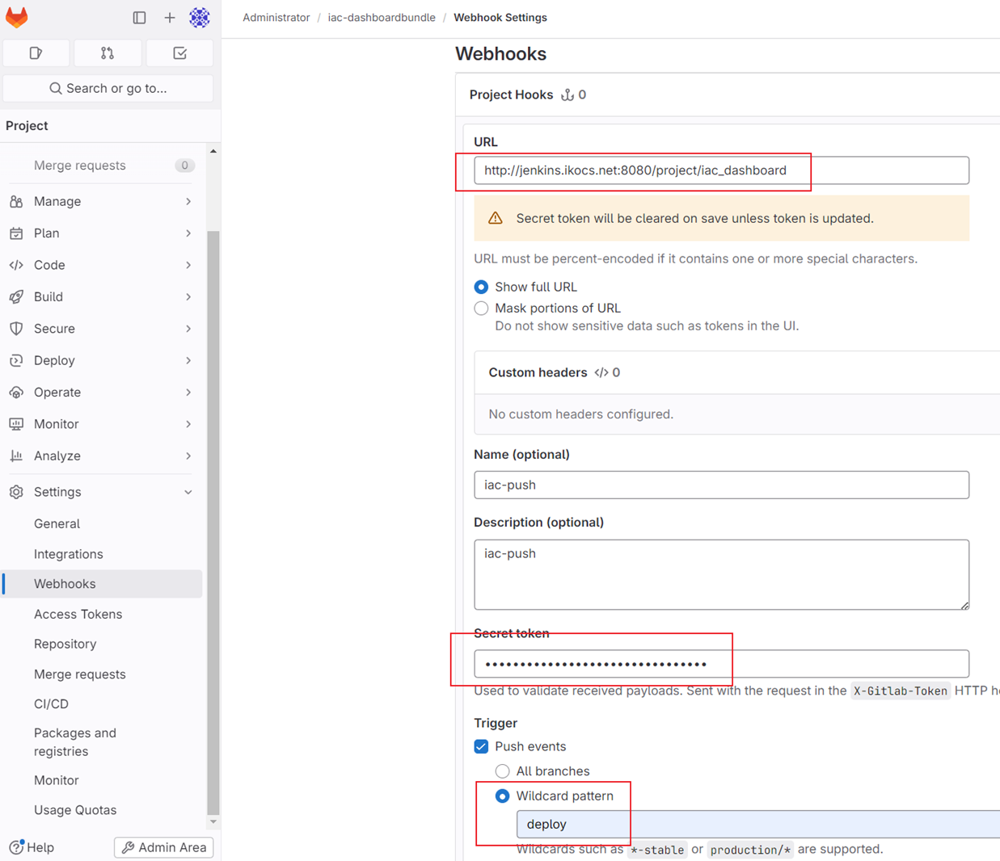

5. **Specify SCM Git in Jenkinsfile**: For `iac_dashboard` and `cicd_dashboard`, specify the SCM Git location of the Jenkinsfile.
   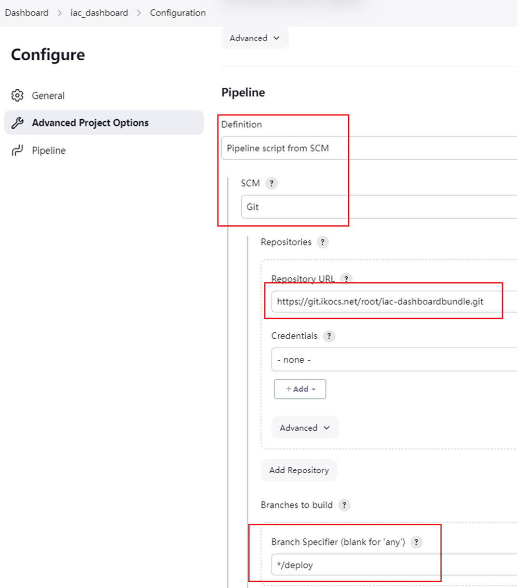

6. **Test GitLab Webhook**: Verify if the GitLab webhook is working correctly. The test button is located here:
   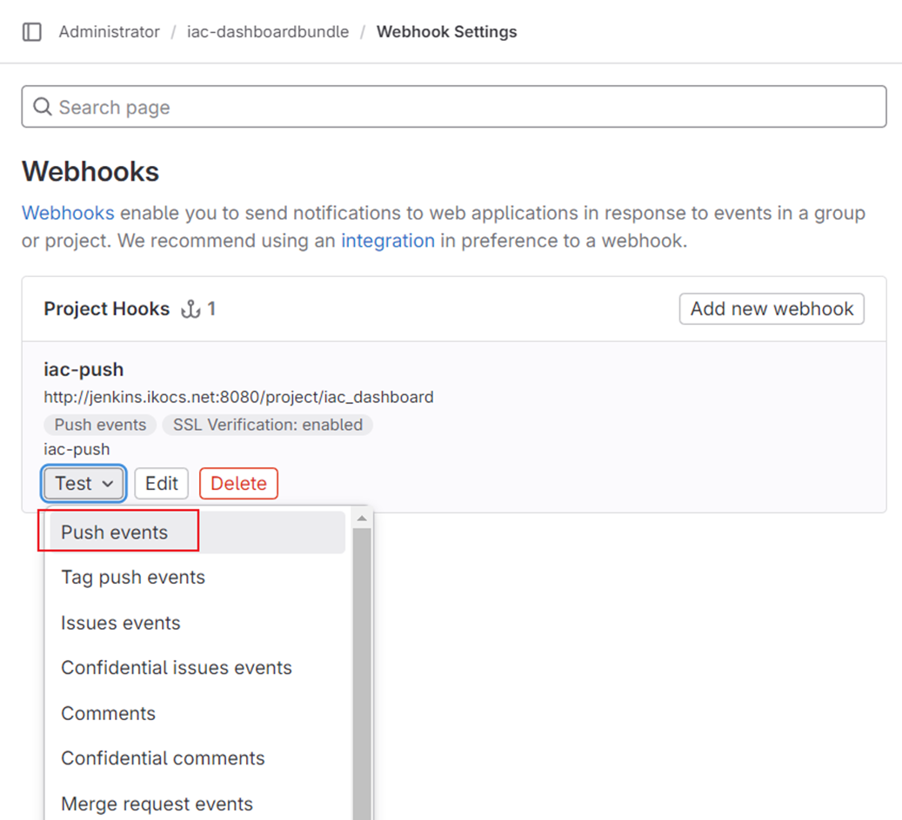

7. **Verify Jenkins Builds**: Upon a new push to the `deploy` branch in the IaC repository, you should see Build #1 in Jenkins.
   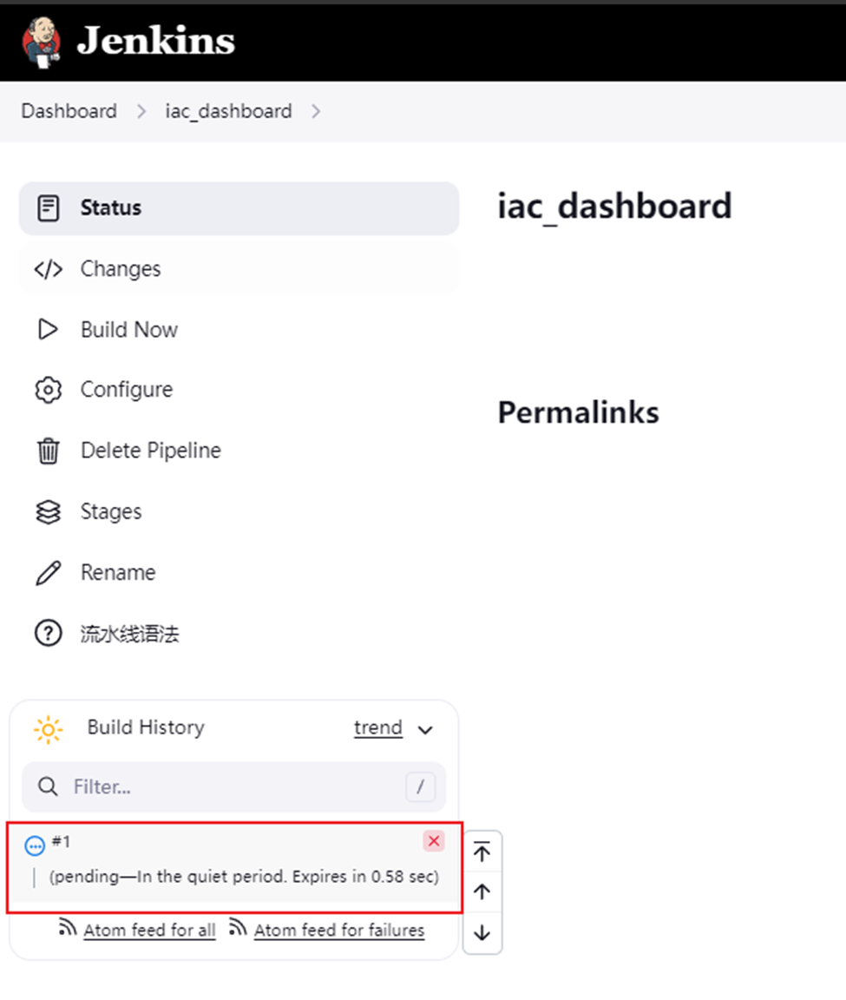

8. **Successful Terraform Apply**: Ensure that Build #1 completes all Terraform apply steps successfully.
   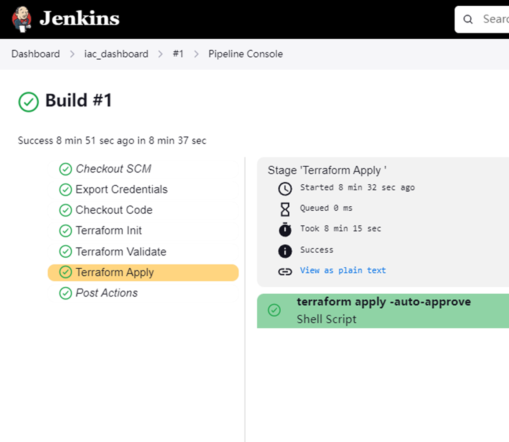

9. **Verify CI/CD Pipeline Builds**: Upon a new push to the `deploy` branch in the CI/CD repository, you should see Build #1 in Jenkins.
   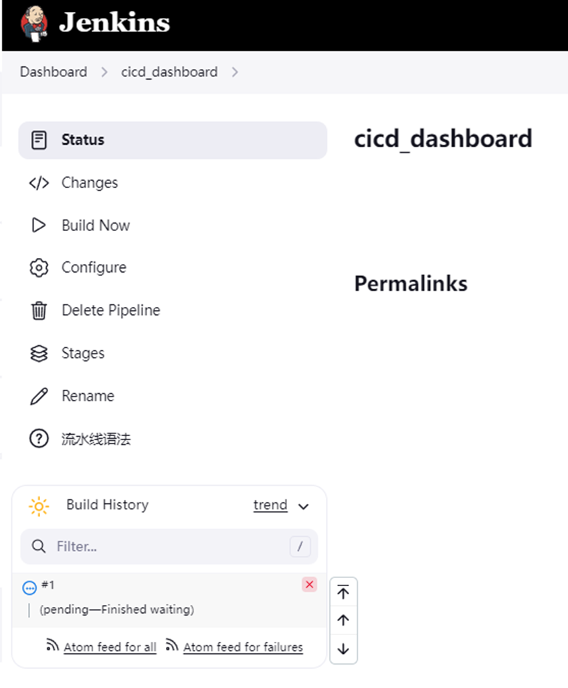

10. **Successful Docker/Kubernetes/Helm Actions**: Ensure that Build #1 completes all Docker, Kubernetes, and Helm actions successfully.
    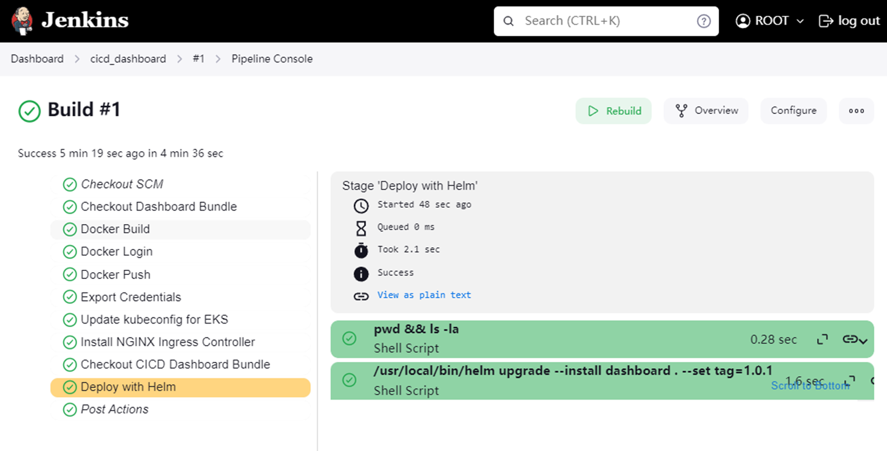

11. **DNS Configuration**: Configure DNS A Records for `pro.dashboard.ikocs.net` and `dashboard.ikocs.net` to point to the LoadBalancer (NGINX) IP.

12. **Results**:
    - 
    - 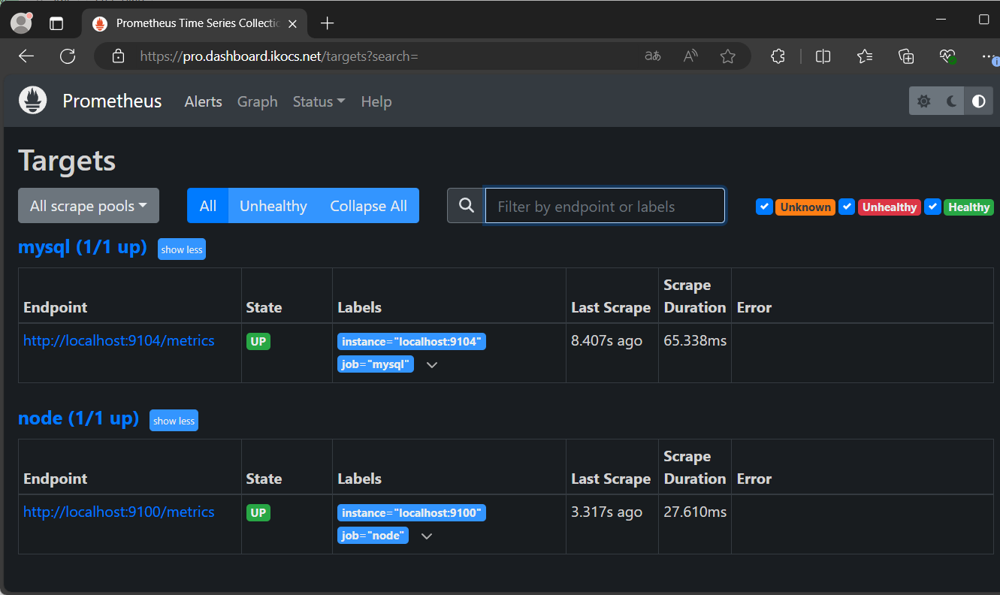

---

By following the above architecture, this project exemplifies a robust CI/CD pipeline using industry-standard tools and practices. It showcases capabilities in infrastructure management, containerization, and orchestration, making it an ideal portfolio project for job interviews.

Feel free to explore the repositories and the detailed Jenkins pipeline configurations to understand the intricacies of this DevOps setup.

---
